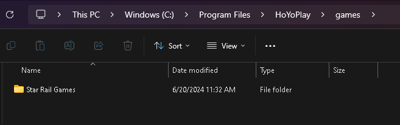

# OSWinStarRail2_3

Honkai: Star Rail version 2.3.0

## Star Rail Games

This repository contains the Star Rail Games. The game files are split into multiple parts and need to be downloaded and extracted to access the full content.

## Download the Files

1. [StarRail_2.3.0](https://autopatchos.starrails.com/client/download/20240608160515_WaNfKntJ7dt6k6rt/PC/StarRail_2.3.0.zip) (Official)
2. [hdiff StarRail_2.2.0_2.3.0](https://autopatchos.starrails.com/client/diff/hkrpg_global/game_2.2.0_2.3.0_hdiff_WwevYToSIVWLRkDA.zip) (Official)

cr. (https://www.reddit.com/user/RhiskOMG/comments/1di273o/direct_download_links_for_honkai_star_rail_23/)

Please download all parts of the `.7z` archive from the links below: (Available download on 21/6/2024 - 28/6/2024)

1. [Star_Rail_Games.7z.001](https://we.tl/t-aqLb4bs28E) (1.9 GB)
2. [Star_Rail_Games.7z.002](https://we.tl/t-JUJvHnXosO) (1.9 GB)
3. [Star_Rail_Games.7z.003](https://we.tl/t-N8M6IlxoNS) (1.9 GB)
4. [Star_Rail_Games.7z.004](https://we.tl/t-atG3ixlMzr) (1.9 GB)
5. [Star_Rail_Games.7z.005](https://we.tl/t-tW02sDGhwM) (1.9 GB)
6. [Star_Rail_Games.7z.006](https://we.tl/t-bnxpOIENDw) (1.9 GB)
7. [Star_Rail_Games.7z.007](https://we.tl/t-hoVtaCWIw7) (1.9 GB)
8. [Star_Rail_Games.7z.008](https://we.tl/t-e7uKcbcYSD) (1.9 GB)
9. [Star_Rail_Games.7z.009](https://we.tl/t-FyAAVayWGF) (1.9 GB)
10. [Star_Rail_Games.7z.010](https://we.tl/t-CdxU4gBYcy) (1.9 GB)
11. [Star_Rail_Games.7z.011](https://we.tl/t-I05522Dhup) (1.9 GB)
12. [Star_Rail_Games.7z.012](https://we.tl/t-AY4445QpmH) (1.9 GB)
13. [Star_Rail_Games.7z.013](https://we.tl/t-t4yf8AwzaX) (1.9 GB)
14. [Star_Rail_Games.7z.014](https://we.tl/t-C5MShVp8Mb) (1.9 GB)
15. [Star_Rail_Games.7z.015](https://we.tl/t-EzSLRYgeVV) (1.9 GB)
16. [Star_Rail_Games.7z.016](https://we.tl/t-1fAZrpsCPf) (1.9 GB)
17. [Star_Rail_Games.7z.017](https://we.tl/t-Crt13iDvkJ) (1.9 GB)
18. [Star_Rail_Games.7z.018](https://we.tl/t-7Ii8A5OVOm) (1.9 GB)
19. [Star_Rail_Games.7z.019](https://we.tl/t-xpC9WGylrY) (1.9 GB)
20. [Star_Rail_Games.7z.020](https://we.tl/t-WauMi1Fb36) (650 MB)

## Extract the Files

To extract the files, you will need a program that can handle `.7z` archives, such as [7-Zip](https://www.7-zip.org/). Follow these steps to extract the archive:

1. Ensure you have downloaded all parts of the `.7z` archive.
2. Place all downloaded files in the same directory.
3. Open `Star_Rail_Games.7z.001` with 7-Zip (or your preferred archive tool).
4. Extract the contents to your desired location. The tool will automatically use the other parts to complete the extraction.

## Download Files

Click I Accept or No thanks

Click I agree

Click Download

## HoYoPlay Download

HoYoPlay :
1. [HoYoPlay (Honkai: Star Rail) (KR)](https://hsr.hoyoverse.com/ko-kr/)
2. [HoYoPlay (Honkai: Star Rail) (TH)](https://hsr.hoyoverse.com/th-th/) 
3. [HoYoPlay (Honkai: Star Rail) (EN)](https://hsr.hoyoverse.com/en-us/)
4. [HoYoPlay (Honkai: Star Rail) (JP)](https://hsr.hoyoverse.com/ja-jp/)
5. [HoYoPlay (Honkai: Star Rail) (CN)](https://hsr.hoyoverse.com/zh-cn/home)

Download HoYoPlay and install in your PC. Rename **Star_Rail_Games** folder to **Star Rail Games** folder and move Star Rail Games folder to C:\your-path\HoYoPlay\games

## MiHoYo
1. [MiHoYo (Honkai: Star Rail) (CN)](https://sr.mihoyo.com/?nav=home)