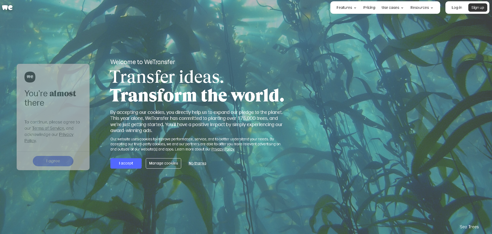
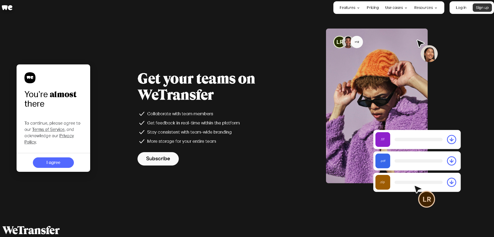
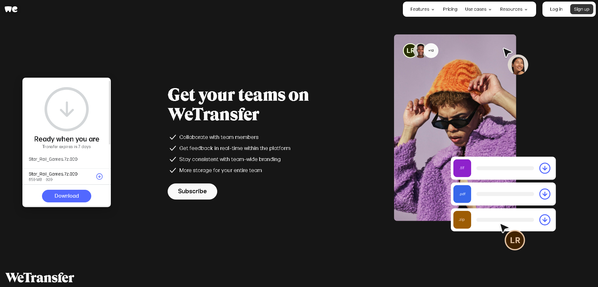

## OSWinStarRail2_3

Honkai: Star Rail vsersion 2.3.0

# Star Rail Games

This repository contains the Star Rail Games. The game files are split into multiple parts and need to be downloaded and extracted to access the full content.

## Download the Files

Please download all parts of the `.7z` archive from the links below:

1. [Star_Rail_Games.7z.001](https://we.tl/t-aqLb4bs28E)
2. [Star_Rail_Games.7z.002](https://we.tl/t-JUJvHnXosO)
3. [Star_Rail_Games.7z.003](https://we.tl/t-N8M6IlxoNS)
4. [Star_Rail_Games.7z.004](https://we.tl/t-atG3ixlMzr)
5. [Star_Rail_Games.7z.005](https://we.tl/t-tW02sDGhwM)
6. [Star_Rail_Games.7z.006](https://we.tl/t-bnxpOIENDw)
7. [Star_Rail_Games.7z.007](https://we.tl/t-hoVtaCWIw7)
8. [Star_Rail_Games.7z.008](https://we.tl/t-e7uKcbcYSD)
9. [Star_Rail_Games.7z.009](https://we.tl/t-FyAAVayWGF)
10. [Star_Rail_Games.7z.010](https://we.tl/t-CdxU4gBYcy)
11. [Star_Rail_Games.7z.011](https://we.tl/t-I05522Dhup)
12. [Star_Rail_Games.7z.012](https://we.tl/t-AY4445QpmH)
13. [Star_Rail_Games.7z.013](https://we.tl/t-t4yf8AwzaX)
14. [Star_Rail_Games.7z.014](https://we.tl/t-C5MShVp8Mb)
15. [Star_Rail_Games.7z.015](https://we.tl/t-EzSLRYgeVV)
16. [Star_Rail_Games.7z.016](https://we.tl/t-1fAZrpsCPf)
17. [Star_Rail_Games.7z.017](https://we.tl/t-Crt13iDvkJ)
18. [Star_Rail_Games.7z.018](https://we.tl/t-7Ii8A5OVOm)
19. [Star_Rail_Games.7z.019](https://we.tl/t-xpC9WGylrY)
20. [Star_Rail_Games.7z.020](https://we.tl/t-WauMi1Fb36)

## Extract the Files

To extract the files, you will need a program that can handle `.7z` archives, such as [7-Zip](https://www.7-zip.org/). Follow these steps to extract the archive:

1. Ensure you have downloaded all parts of the `.7z` archive.
2. Place all downloaded files in the same directory.
3. Open `Star_Rail_Games.7z.001` with 7-Zip (or your preferred archive tool).
4. Extract the contents to your desired location. The tool will automatically use the other parts to complete the extraction.

## Download Files

Click I Accept or No thanks

Click I agree

Click Download
